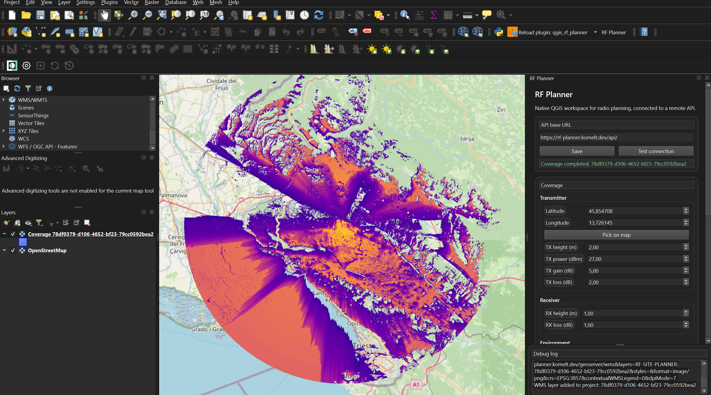

# RF Planner QGIS Plugin

Native PyQt/QGIS plugin scaffold for RF site planning.
Targeted at QGIS 4.0.

## Current state

- Right-side dock widget that opens on the right automatically
- Coverage form split into Transmitter, Receiver, Environment, and Output sections
- `Pick on map` coordinate pipette
- Inline API URL save and test controls
- Save/load coverage parameters in QSettings
- Resizable bottom debug log panel
- Coverage request submission and WMS layer insertion into the QGIS project

## Development target

The plugin is intentionally native. It does not embed the Vue app.
The Vue app in `rf-site-planner/` is kept as a reference for behavior and layout only.

## Suggested QGIS development loop

1. Copy or symlink `qgis_rf_planner/` into your QGIS plugin directory.
2. Enable the plugin in QGIS.
3. Open the dock widget from the toolbar or plugin menu.
4. Enter the API URL and click Save.
5. Use `Pick on map`, then save or load coverage parameters as needed.
6. Run coverage and watch the debug panel for request details and status.
